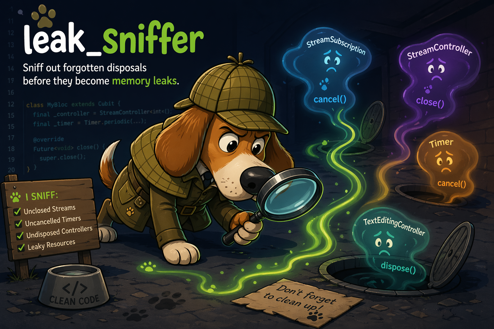

# leak_sniffer Workspace

Sniff out forgotten disposals before they become memory leaks.



This repository is a production-style starter workspace for a reusable `custom_lint` package named `leak_sniffer`. It includes:

- `packages/leak_sniffer`: the publishable lint package
- `apps/leak_sniffer_example`: a real Flutter app with passing and failing samples
- `tool/`: bootstrap, watch, and test automation
- `Makefile`: one-command shortcuts for common tasks

The published package is designed to be plug-and-play for consumers:

```yaml
dev_dependencies:
  leak_sniffer: ^0.1.1
```

```bash
dart run leak_sniffer
```

For CLI or CI verification in a consuming project, run `dart run leak_sniffer --check`.

## Workspace Quick Start

```bash
make setup
make watch
```

`make setup` installs dependencies for both the lint package and the example app. `make watch` starts `custom_lint` in watch mode against the example app so you can iterate on rules immediately.

These commands are for developing this repository itself, not for app teams consuming `leak_sniffer`.

## Workspace Layout

```text
.
├── apps/
│   └── leak_sniffer_example/
├── packages/
│   └── leak_sniffer/
├── tool/
│   ├── bootstrap.sh
│   ├── test.sh
│   └── watch.sh
└── Makefile
```

## Useful Commands

```bash
make setup   # install dependencies
make watch   # run custom_lint --watch on the example app
make test    # analyze and test the workspace
```

The publish-ready package documentation lives at [packages/leak_sniffer/README.md](/Users/tolba/StudioProjects/leak_sniffer/packages/leak_sniffer/README.md).
